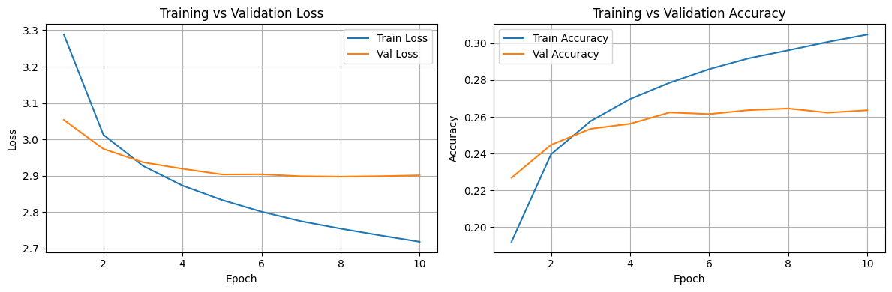
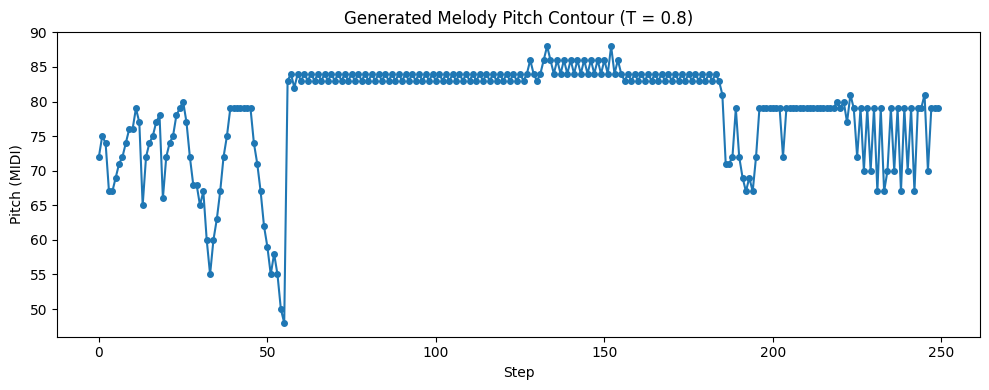
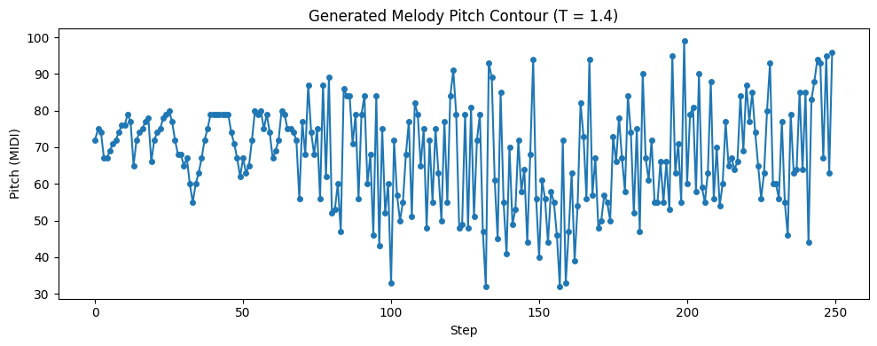

# Music Generation with GRUs
A sequence-modeling project that generates short musical melodies from either preset motifs or user-defined seeds.

## What it Does
This project generates short musical melodies using a GRU-based neural network trained on tokenized, monophonic MIDI files drawn from a classical music dataset. The system produces new music by continuing from an initial seed sequence, which can come from the dataset, from preset melodies, or from user-provided custom notes. The model aims to produce sequences where token values evolve smoothly rather than jumping abruptly, reflecting musically plausible movement in pitch and timing. An interactive Streamlit interface allows users to choose a seed type, generate music, and listen to their output.

## Quick Start
All commands below assume you are in the project root directory.

### 1. Clone the repository
```
git clone https://github.com/cmbata1/music-generation-project.git
cd music-generation-project
```

### 2. Install dependencies
```
pip install -r requirements.txt
```

### 3. Download the processed dataset

    The Streamlit app cannot run without the processed sequence file. Download the dataset using the link [here](https://drive.google.com/uc?export=download&id=1khv6_3rRCDJ27viPqy3eqDezGD2r02KQ).
    
    Then, move the downloaded file into:
    `data/processed/` 

    So the full path becomes:
    -   `data/processed/full_sequences.npz`

### 4. Run the Streamlit app from the project root:
```
streamlit run src/app.py
```

For training instructions and full environment setup, see SETUP.md.

## Video Links

## Evaluation
### Quantitative Results
The GRU model was trained as a next-token predictor over tokenized musical sequences, where each token encodes a `(pitch, duration_bucket)` pair.

Final metrics:
-   Training loss: `2.72`
-   Validation loss: `2.94`
-   Final perplexity: `5.21`

Loss decreased smoothly over training. Validation loss also decreased without significant divergence, indicating that the model generalized reasonably well to unseen sequences.

Training and validation loss and accuracy curves:


### Qualitative Results
#### Effect of Sampling Temperature on Musical Structure
To assess how sampling temperature affects the model’s outputs, sequences were generated using the same seed at two temperatures:
-   T = 0.8 (moderate)
-   T = 1.4 (high)

The pitch-vs-step plots show the progression of the generated sequence over time.





Comparison:
-   T = 0.8 produces smoother, more stable pitch changes within a narrow range, often moving gradually up or down rather than making large jumps.
-   T = 1.4 leads to frequent large jumps, greater variability, and no consistent structure.
-   Lower temperatures keep sampling near high-probability predictions, while higher temperatures introduce significantly more randomness.

### Additional Analysis
More detailed investigation of model behavior under edge-cases (repeated-note, single-token, and random seeds) is provided in the 03_generation.ipynb notebook, including pitch–vs–step plots and discussion of stability, drift, and recovery patterns.

### Individual Contributions
This project was completed individually.
